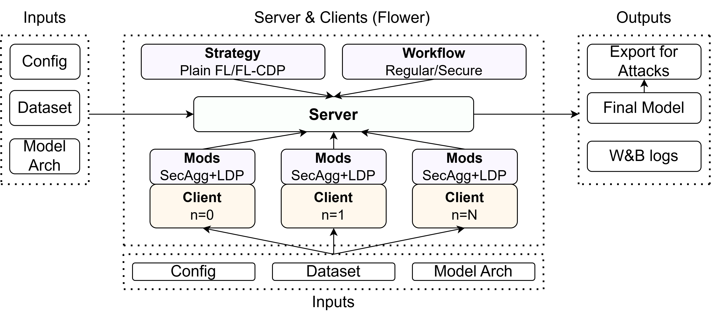

# Enhancement of Data Privacy Protection in Federated Learning



## Abstract

Federated learning reduces the need to centralize raw data, but it does not by itself prevent privacy leakage from client updates, aggregation messages, or the final released model. This project implements and evaluates privacy-enhancing techniques in federated learning, especially Differential Privacy and Secure Aggregation, in a low-client-count cross-silo setting with full client participation. The evaluation covers three task types: image classification, tabular binary classification, and network-monitoring time-series prediction.

The implementation combines federated training with configurable aggregation, client-side local differential privacy, server-side central differential privacy, centralized baselines, and post-training privacy attacks. The experimental workflow includes dataset preparation, hyperparameter and privacy-parameter sweeps, utility evaluation, and final-model attacks, namely membership inference and targeted reconstruction. Secure Aggregation is treated as a training-time confidentiality mechanism that hides individual client updates from the server during aggregation, whereas Differential Privacy is treated as a statistical privacy mechanism that can influence leakage from the final model.

The repository is intended to support reproducible experimentation. It contains run scripts, W&B sweep configurations, dataset preparation notebooks, federated and centralized training entry points, model definitions, and attack pipelines that produce tabular attack results. The codebase was optimized for Ubuntu 24 and Python 3.11. Other operating systems may require additional adaptation, especially for shell scripts, process cleanup, TensorFlow installation, and Flower runtime behavior.

## Repository Structure

The expected structure of the project archive is shown below. Some generated directories, such as `saves`, `artifacts`, and attack export folders, may be empty before the first execution.

```text
.
├── assets
│   └── FL_Framework.png
├── attacks
│   ├── mia_attack_baseline.py
│   ├── mia_attack_learned.py
│   ├── mia_pipeline.py
│   ├── reconstruction_attack_baseline.py
│   ├── reconstruction_attack_extended.py
│   ├── reconstruction_pipeline.py
│   ├── exports_mia
│   ├── exports_recon
│   ├── mia_results.csv
│   └── recon_results.csv
├── config
│   ├── cifar_*.yaml
│   ├── network_*.yaml
│   ├── smoking_*.yaml
│   ├── attack_experiments.yaml
│   └── config.py
├── data
│   ├── dataset_loader.py
│   ├── partition_functions.py
│   ├── body_signal_of_smoking
│   │   ├── data_raw.csv
│   │   └── data.csv
│   ├── cifar10
│   └── network_monitoring
├── federation
│   ├── client
│   ├── server
│   ├── model.py
│   └── weighted_average.py
├── notebooks
│   ├── body_signal_of_smoking_eda.ipynb
│   ├── cifar10_eda.ipynb
│   └── network_monitoring_eda.ipynb
├── saves
├── artifacts
├── run.sh
├── run_sweep.sh
├── client_app.py
├── server_app.py
├── train_centralized.py
├── reqs_fl.txt
├── reqs_centralized.txt
├── README.md
```

## Main Components

The implementation is organized around four execution layers.

First, the dataset preparation layer contains notebooks in `notebooks/`. These notebooks should be executed before training so that raw data are transformed into the files expected by the data loader. For the body-signal smoking dataset, the notebook reads `data/body_signal_of_smoking/data_raw.csv`, performs feature engineering, and writes the processed file to `data/body_signal_of_smoking/data.csv`. The CIFAR-10 notebook relies on the TensorFlow/Keras dataset loader and mainly supports inspection, statistics, and sanity checks. The network-monitoring dataset should be prepared analogously before the first network-monitoring experiment.

Second, the configuration layer consists of YAML files in `config/` and environment-driven runtime configuration in `config/config.py`. Dataset-specific sweep files follow names such as `cifar_fl.yaml`, `cifar_fl_dp_local.yaml`, `smoking_fl_dp_central.yaml`, or `network_centralized.yaml`. The YAML files define W&B grid-search parameters. The Python configuration object then reads command-line values exported by `run.sh` as environment variables.

Third, the training layer contains the Flower client and server applications. `client_app.py` attaches Flower client-side modifiers such as Secure Aggregation, fixed clipping, and local differential privacy when requested by the active configuration. `server_app.py` creates the server strategy, wraps it with central differential privacy when required, chooses the regular or SecAgg+ workflow, runs the Flower workflow, and optionally exports the final global model for attack evaluation. Centralized non-federated experiments are executed through `train_centralized.py`.

Fourth, the attack layer contains two privacy-attack pipelines. `mia_pipeline.py` trains or loads retained models and evaluates them with baseline loss-based and learned logistic-regression membership-inference attacks. `reconstruction_pipeline.py` trains or loads retained models and evaluates targeted reconstruction attacks with baseline and stronger multi-restart optimization variants. The produced CSV files are `attacks/mia_results.csv` and `attacks/recon_results.csv`.

## Prerequisites

The project was implemented and tested for the following baseline environment:

- Ubuntu 24, preferably with Bash available as the command shell.
- Python 3.11.
- Two Python virtual environments in the project root: `venv` and `venv_dp`.
- Weights & Biases account for sweep management and experiment logging.
- Optional CUDA-compatible GPU. The code can run on CPU, but image and time-series experiments are significantly slower.

The project uses shell scripts and process-control commands such as `pkill`, `flower-superlink`, `flower-client-app`, and `flower-server-app`. For this reason, Ubuntu is the recommended execution platform. Running the same scripts on Windows or macOS can require modification.

## Installation Manual

### 1. Obtain the project

Clone the repository or unpack the submitted archive, then enter the project root.


### 2. Install system-level prerequisites

On Ubuntu 24, install Python 3.11 and common build tools if they are not already present.

```bash
sudo apt update
sudo apt install python3.11 python3.11-venv python3.11-dev build-essential git
```

### 3. Create the federated-learning environment

The main environment is called `venv`. It is used for Flower-based federated experiments, including plain FL, FL with Secure Aggregation, FL with local differential privacy, and FL with central differential privacy.

```bash
python3.11 -m venv venv
source venv/bin/activate
python -m pip install --upgrade pip setuptools wheel
pip install -r reqs_fl.txt
```

If the Flower fork is stored locally rather than installed from the editable Git entry in `reqs_fl.txt`, install it manually from the local directory:

```bash
pip install -e /path/to/local/flower
```

Then deactivate the environment:

```bash
deactivate
```

### 4. Create the centralized/DP environment

The second environment is called `venv_dp`. It is used mainly for centralized training and centralized DP training. In the supplied files, the requirements file is named `reqs_centralized.txt`. 

```bash
python3.11 -m venv venv_dp
source venv_dp/bin/activate
python -m pip install --upgrade pip setuptools wheel
pip install -r reqs_centralized.txt
```

Then deactivate the environment:

```bash
deactivate
```

### 5. Make scripts executable

```bash
chmod +x run.sh
chmod +x run_sweep.sh
```

### 6. Configure Weights & Biases

Log in to W&B from at least one environment. If W&B is not available in the second environment, repeat the login there as well.

```bash
source venv/bin/activate
wandb login
deactivate

source venv_dp/bin/activate
wandb login
deactivate
```

The current implementation contains two project-name conventions. Several scripts currently log to `diplom_dp_fl`, while the example sweep YAML uses `privacy_preserving_federated_learning`. For clean reproducibility, choose one name and use it consistently in:

- `run_sweep.sh`, variable `PROJECT_NAME`;
- `server_app.py`, the `wandb.init(...)` call;
- `train_centralized.py`, the `wandb.init(...)` call;
- the `project` field in all W&B sweep YAML files.

A recommended stable choice for the thesis archive is:

```text
privacy_preserving_federated_learning
```

## Dataset Preparation

Dataset preparation must be completed before running the training scripts.

### Body Signal of Smoking

1. FInd the raw CSV file at:

```text
data/body_signal_of_smoking/data_raw.csv
```

If it is abscent or damaged, you can find it in the origin [here](https://www.kaggle.com/datasets/kukuroo3/body-signal-of-smoking)

2. Start Jupyter from the federated-learning environment:

```bash
source venv/bin/activate
jupyter lab
```

3. Open and run:

```text
notebooks/body_signal_of_smoking_eda.ipynb
```

4. Confirm that the processed dataset was created:

```text
data/body_signal_of_smoking/data.csv
```

The notebook performs basic inspection, feature engineering, and exports the processed dataset used by the training pipeline.

### CIFAR-10

CIFAR-10 is loaded through TensorFlow/Keras. The notebook is used mainly for exploratory analysis and dataset sanity checks.

```bash
source venv/bin/activate
jupyter lab notebooks/cifar10_eda.ipynb
```

The first training run may download CIFAR-10 automatically if it is not already cached by TensorFlow/Keras.

### Network Monitoring

The network-monitoring dataset doesn't require any preparation but EDA notebook is still available at notebooks/ folder. You can run the notebook by executing next command:

```bash
source venv/bin/activate
jupyter lab notebooks/network_monitoring_eda.ipynb
```

## Configuration Guide

### Runtime configuration

`run.sh` accepts command-line parameters and exports them as environment variables. The main supported parameters are:

```text
aggregation_type   regular | secure
partition_type     iid | noniid | vertical | centralized
dp                 true | false
local              true | false
clipping           server | client
l2_norm_clip       numeric clipping norm
noise_multiplier   numeric Gaussian noise multiplier for central DP
epsilon            total epsilon used by local DP logic
delta              total delta used by local DP logic
learning_rate      optimizer learning rate
batch_size         local or centralized batch size
epochs             number of centralized epochs or FL rounds
no_fl              true for centralized training, false for FL
n_clients          number of federated clients
dataset            body_signal_of_smoking | cifar10 | network_monitoring
```

The Python configuration object also defines default values. If a parameter is omitted from the command, the default in `config/config.py` is used.

### Sweep configuration files

Sweep files are stored in `config/`. A typical sweep file has this form:

```yaml
program: run.sh
project: privacy_preserving_federated_learning
method: grid

parameters:
  dataset:
    value: "cifar10"
  aggregation_type:
    value: "regular"
  dp:
    value: False
  n_clients:
    values: [3, 6, 10]
  partition_type:
    value: "iid"
  learning_rate:
    value: 0.0005
  batch_size:
    value: 16
  epochs:
    value: 50
  l2_norm_clip:
    values: [1, 5]

command:
  - ${env}
  - bash
  - ${program}
  - ${args}
```

Single values create fixed settings. Lists under `values` create grid-search dimensions. Therefore, increasing the number of values in a YAML file directly increases the number of training runs in the corresponding sweep.

### Attack configuration file

`config/attack_experiments.yaml` is used to define the retained configurations for privacy attacks. It contains a `defaults` section and one section per experiment. Scalar values are fixed. List values are expanded as a grid.

Important fields include:

```text
dataset             dataset to use for the experiment
no_fl               true for centralized training, false or omitted for FL
dp                  enables or disables DP
local               true for local DP, false for central DP
clipping            clipping location for central DP
noise_multiplier    central-DP noise multiplier
epsilon             local-DP epsilon
l2_norm_clip        clipping norm
n_clients           client-count grid
leaky_train_frac    fraction of training data retained in the leaky setting
canary_frac         fraction of canary samples
canary_dups         number of canary duplicates
canary_flip         whether canary labels are flipped
epochs              number of epochs or FL rounds
batch_size          batch size
learning_rate       learning rate
```

Because the attack pipelines have older default config names in their argument parsers, pass the attack config explicitly when running them:

```bash
python ./attacks/mia_pipeline.py --config config/attack_experiments.yaml --verbose
python ./attacks/reconstruction_pipeline.py --config config/attack_experiments.yaml --verbose
```

## Running a Single Experiment

For a single manual run, activate the correct environment first, then call `run.sh` from the project root.

### Plain federated CIFAR-10

```bash
source venv/bin/activate
./run.sh \
  --dataset=cifar10 \
  --aggregation_type=regular \
  --partition_type=iid \
  --n_clients=3 \
  --dp=false \
  --learning_rate=0.0005 \
  --batch_size=16 \
  --epochs=50
deactivate
```

### Federated CIFAR-10 with Secure Aggregation

```bash
source venv/bin/activate
./run.sh \
  --dataset=cifar10 \
  --aggregation_type=secure \
  --partition_type=iid \
  --n_clients=3 \
  --dp=false \
  --learning_rate=0.0005 \
  --batch_size=16 \
  --epochs=50
deactivate
```

### Federated CIFAR-10 with central DP

```bash
source venv/bin/activate
./run.sh \
  --dataset=cifar10 \
  --aggregation_type=regular \
  --partition_type=iid \
  --n_clients=3 \
  --dp=true \
  --local=false \
  --clipping=server \
  --noise_multiplier=0.6070 \
  --l2_norm_clip=1 \
  --learning_rate=0.0005 \
  --batch_size=16 \
  --epochs=50
deactivate
```

### Federated CIFAR-10 with local DP

```bash
source venv/bin/activate
./run.sh \
  --dataset=cifar10 \
  --aggregation_type=regular \
  --partition_type=iid \
  --n_clients=3 \
  --dp=true \
  --local=true \
  --epsilon=5.0 \
  --delta=1e-5 \
  --l2_norm_clip=1 \
  --learning_rate=0.0005 \
  --batch_size=16 \
  --epochs=50
deactivate
```

### Centralized CIFAR-10 baseline

Centralized runs should be executed from `venv_dp`.

```bash
source venv_dp/bin/activate
./run.sh \
  --dataset=cifar10 \
  --no_fl=true \
  --dp=false \
  --learning_rate=0.001 \
  --batch_size=16 \
  --epochs=50
deactivate
```

### Centralized CIFAR-10 with DP-SGD

```bash
source venv_dp/bin/activate
./run.sh \
  --dataset=cifar10 \
  --no_fl=true \
  --dp=true \
  --noise_multiplier=0.6070 \
  --l2_norm_clip=1 \
  --learning_rate=0.001 \
  --batch_size=16 \
  --epochs=50
deactivate
```

## Running Sweep Experiments

Sweeps are controlled through `run_sweep.sh`. Each uncommented `run_sweep "..."` line creates a W&B sweep from `config/<sweep_name>.yaml` and then launches a W&B agent for that sweep.

1. Open `run_sweep.sh`.
2. Uncomment only the sweep rows that should be executed.
3. Verify the corresponding YAML files in `config/`.
4. Make sure W&B is logged in.
5. Deactivate any active virtual environment.
6. Run the sweep script from the project root.

```bash
deactivate 2>/dev/null || true
./run_sweep.sh
```

The script selects the virtual environment based on the sweep name. Centralized sweeps and sweeps ending in `_dp` are executed in `venv_dp`; the other sweeps are executed in `venv`. Review this logic if new sweep names are added.

The sweep script runs sweeps sequentially. It is therefore suitable for reproducible batch experiments, but it can take a long time for large grids or image experiments.

## Running Privacy-Attack Experiments

The attack pipelines should be stored in the `attacks/` directory because they assume paths relative to that directory and call `../run.sh` internally.

Before running attacks, ensure that:

- both virtual environments have been created;
- datasets have been prepared;
- `config/attack_experiments.yaml` contains the retained configurations to evaluate;
- no unrelated Flower processes are running;
- the Python interpreter used to start the pipeline has `PyYAML` installed, because the pipeline reads YAML before it activates the experiment-specific virtual environment.

A safe setup is to start the attack pipeline from `venv`, because `reqs_fl.txt` already includes `PyYAML`.

### Membership inference pipeline

```bash
source venv/bin/activate
python ./attacks/mia_pipeline.py --config config/attack_experiments.yaml --verbose
deactivate
```

This pipeline exports trained models to:

```text
attacks/exports_mia/
```

and writes the result table to:

```text
attacks/mia_results.csv
```

The CSV contains the experiment configuration, exported model path, baseline attack metrics, learned attack metrics, status, and error message if a run failed.

### Reconstruction pipeline

```bash
source venv/bin/activate
python ./attacks/reconstruction_pipeline.py --config config/attack_experiments.yaml --verbose
deactivate
```

This pipeline exports trained models to:

```text
attacks/exports_recon/
```

and writes the result table to:

```text
attacks/recon_results.csv
```

By default, the reconstruction pipeline evaluates multiple sampled target records. The most relevant command-line arguments are:

```text
--num-targets       number of target records to evaluate
--targets-seed      seed for target selection
--target-split      train or test
--targets           comma-separated explicit target indices
--attack-saved      attack already exported models instead of training new ones
--exports-dir       directory containing exported .keras models
```

Example for attacking already exported reconstruction models:

```bash
source venv/bin/activate
python ./attacks/reconstruction_pipeline.py \
  --attack-saved \
  --exports-dir ./attacks/exports_recon \
  --dataset cifar10 \
  --num-targets 10 \
  --target-split train \
  --verbose
deactivate
```

## Results and Visualization

Each standard federated execution produces artifacts in `saves/`. File names include the dataset, aggregation type, partition type, client count, number of rounds, and timestamp.

Typical saved artifacts include:

```text
*.history.pkl       global training history
*.weights.h5        model weights
*.lclmetrics.csv    client-side metrics
server_log.txt      console log captured from the server app
```

When model export is enabled for attack experiments, final `.keras` models are stored either in `artifacts/` or in the attack export directories, depending on the execution mode.

Attack result files are:

```text
attacks/mia_results.csv
attacks/recon_results.csv
```

These CSV files can be loaded into a notebook or spreadsheet for analysis. The existing `visualization.ipynb` can be used to inspect training curves, W&B metrics, and retained configurations.

## Reproducibility Checklist

For a clean reproduction of the thesis experiments, complete the following sequence:

1. Use Ubuntu 24 and Python 3.11.
2. Unpack the project archive or clone the repository.
3. Create `venv` from `reqs_fl.txt`.
4. Create `venv_dp` from `reqs_centralizedp.txt` or the equivalent centralized requirements file in the archive.
5. Install the required Flower fork either from the editable requirement or from a local clone.
6. Run the dataset preparation notebooks in `notebooks/`.
7. Verify the processed files under `data/`.
8. Choose one W&B project name and make it consistent across shell scripts, Python scripts, and YAML files.
9. Review each sweep YAML file and adjust only the parameters that should be part of the grid.
10. Edit `run_sweep.sh` and uncomment the target sweeps.
11. Run `./run_sweep.sh` from the project root with no active virtual environment.
12. Select retained models and configurations for attack evaluation.
13. Review `config/attack_experiments.yaml`.
14. Run the MIA and reconstruction pipelines with the explicit config argument.
15. Archive `saves/`, `artifacts/`, `attacks/exports_mia/`, `attacks/exports_recon/`, `attacks/mia_results.csv`, `attacks/recon_results.csv`, W&B run links, and the exact YAML files used.

## Troubleshooting Notes

### W&B logs appear in the wrong project

Check all project-name definitions. In the current implementation, `run_sweep.sh`, `server_app.py`, `train_centralized.py`, and sweep YAML files may not all use the same project name.

### The attack pipeline cannot find `../run.sh`

The attack pipeline is expected to be inside the `attacks/` directory. If it is moved to the project root, relative paths inside the pipeline must be adjusted.

### The attack pipeline fails before activating a virtual environment

Install `PyYAML` in the interpreter used to launch the pipeline or run the pipeline from `venv`.

```bash
source venv/bin/activate
python -m pip install PyYAML
```

### A sweep uses the wrong virtual environment

Review the `activate_venv` function in `run_sweep.sh`. It chooses environments from the sweep name. New naming conventions may require updating that function.

### Secure aggregation fails with a small number of clients

The configuration derives the number of shares from the number of clients, with a minimum of three shares. Secure aggregation is therefore most reliable in experiments with at least three clients.

### Centralized DP fails with a microbatch error

For DP-SGD, `batch_size` must be divisible by `num_microbatches`. In this implementation, `num_microbatches` defaults to `1`, but the condition should still be checked if this value is changed.

### TensorFlow/Keras version conflicts occur

Keep the two-environment separation. The Flower environment uses the packages from `reqs_fl.txt`, while the centralized DP environment uses the packages from `reqs_centralizedp.txt`. Mixing these environments can cause TensorFlow, Keras, or TensorFlow Privacy incompatibilities.

## Notes for the Submitted Archive

For reproducibility, the submitted ZIP archive should include the following items:

```text
source code
configuration YAML files
requirements files
dataset preparation notebooks
processed datasets or clear raw-data acquisition instructions
run scripts
attack scripts
visualization notebook
README and technical documentation
selected result CSV files
```

Large generated artifacts such as model exports, W&B cache files, and raw datasets may be excluded only if their regeneration procedure is documented clearly and the required external inputs are available.
